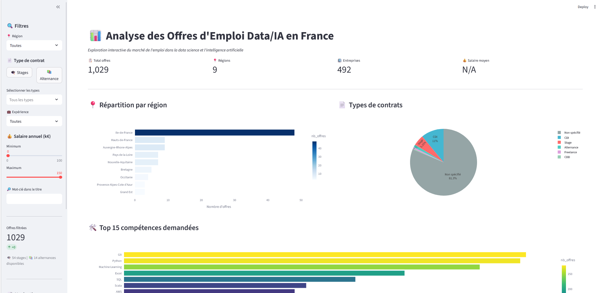
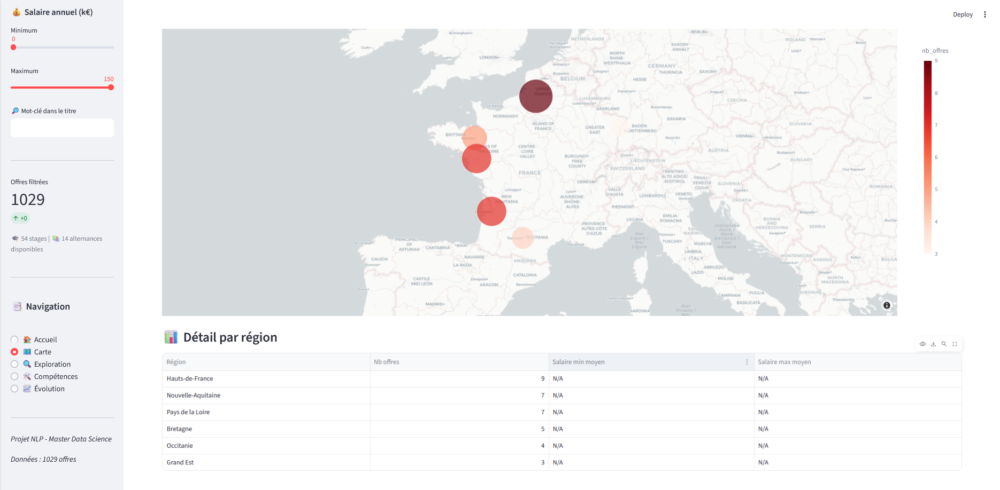
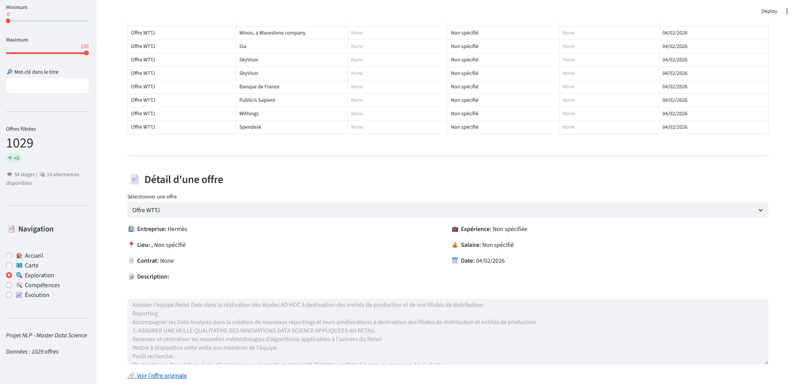
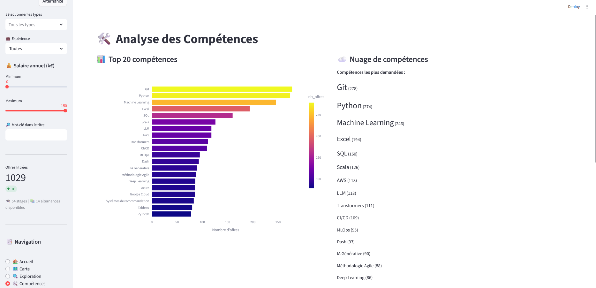

# Analyse des offres d'emploi Data/IA en France

Pipeline ETL et dashboard interactif pour collecter, enrichir et analyser les offres d'emploi dans les métiers de la Data Science et de l'IA en France.

> Projet réalisé dans le cadre du Master 2 SISE (Statistique et Informatique pour la Science des données).

---

## Aperçu






---

## Fonctionnalités

- **Collecte multi-sources** : API France Travail (OAuth2) + scrapers web (WTTJ, Indeed, HelloWork)
- **Stockage structuré** : entrepôt de données SQLite en schéma étoile (1 table de faits, 9 dimensions)
- **Enrichissement NLP** :
  - Extraction de compétences par dictionnaire (~200 patterns)
  - Extraction par LLM local (Ollama/Mistral)
  - Normalisation des salaires et des régions
- **Dashboard interactif** : application Streamlit avec carte géographique, filtres dynamiques et visualisations Plotly
- **Conteneurisé** : Dockerfile inclus pour un déploiement sans configuration

---

## Architecture

```
Collecte                  Stockage              Analyse
─────────────────         ──────────────        ──────────────────
API France Travail ──┐
Scraper WTTJ       ──┼──► SQLite (étoile) ──► Enrichissement ──► Dashboard
Scraper Indeed     ──┤    fait_offres          NLP                Streamlit
Scraper HelloWork  ──┘    9 dimensions
```

Le modèle de données complet est documenté dans [doc/documentation_modele.md](doc/documentation_modele.md).

---

## Installation

### Prérequis

- Python 3.11+
- (Optionnel) Docker

### Lancement rapide

```bash
# Cloner le repo
git clone https://github.com/Nivrami/NLP---Analyse_offre_emplois.git
cd NLP---Analyse_offre_emplois

# Installer les dépendances
pip install -r requirements.txt

# Configurer les credentials API
cp .env.example .env
# Éditer .env avec vos identifiants France Travail

# Lancer le dashboard
streamlit run app.py
```

### Avec Docker

```bash
docker build -t nlp-offres .
docker run -p 8501:8501 nlp-offres
```

Puis ouvrir [http://localhost:8501](http://localhost:8501).

---

## Collecte des données

```bash
# Collecter les offres data/IA (France Travail)
python collect_offres.py --all-data-jobs

# Enrichissement NLP
python enrichissement.py --competences
python enrichissement.py --salaires
python enrichissement.py --regions
```

Les credentials API France Travail sont à configurer dans le fichier `.env` (voir `.env.example`).

---

## Structure du projet

```
.
├── app.py                  # Dashboard Streamlit (point d'entrée)
├── collect_offres.py       # ETL principal — collecte via API
├── enrichissement.py       # Enrichissement NLP des offres
├── requirements.txt
├── Dockerfile
├── .env.example            # Template de configuration
├── api/
│   └── france_travail_client.py   # Client OAuth2 France Travail
├── database/
│   ├── schema.py           # Création du schéma SQLite
│   └── db_utils.py         # Fonctions d'accès partagées
├── scrapers/
│   ├── scraper_wttj.py
│   ├── scraper_indeed.py
│   └── scraper_hellowork.py
├── data/                   # Base SQLite (non versionnée)
└── doc/                    # Documentation et schémas
```

---

## Données

La base contient actuellement **1 029 offres actives** collectées depuis France Travail, couvrant les métiers : Data Scientist, Data Analyst, Data Engineer, Machine Learning Engineer, NLP Engineer, et autres profils Data/IA.

La base de données (`data/offres_emploi.db`) n'est pas versionnée. Pour reconstituer une base, lancer la collecte après configuration des credentials.

---


## Licence

MIT — voir [LICENSE](LICENSE).
